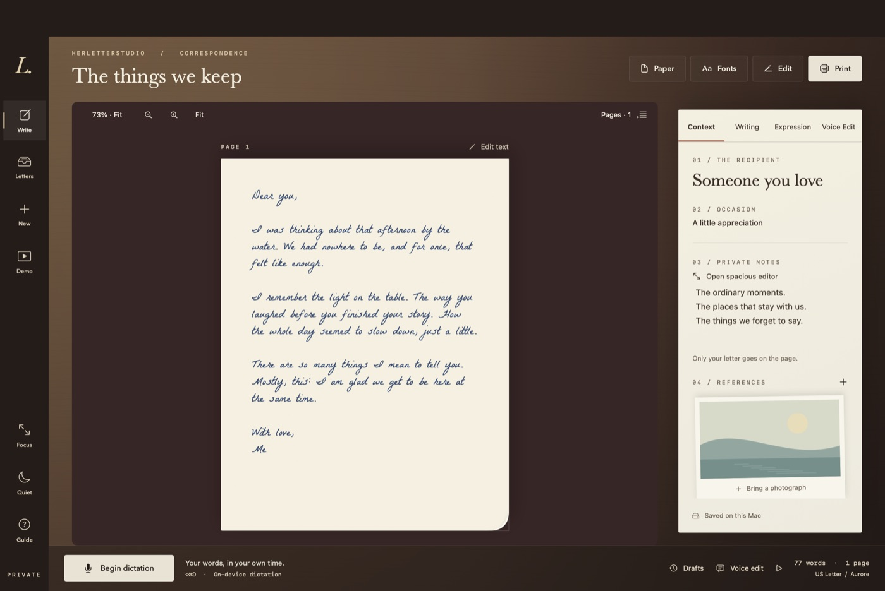
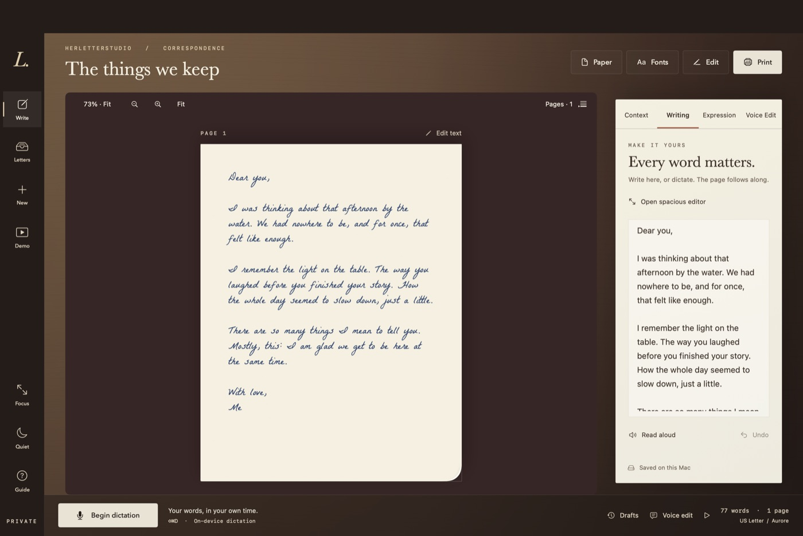

# HerLetterStudio

Some letters deserve more than a font. HerLetterStudio is a native Mac writing desk inspired by *Her*: you speak or type your words, and they appear in handwriting on paper — ink, stationery, and all. When the page is right, print it or keep it as a PDF.

Dictation runs on-device. No account, no cloud, no paid API. Requires macOS 26.



## Try it in 5 minutes

No microphone needed. The app comes with a guided sample:

1. Build and open the app (see [Build](#build)), then click **Demo** in the left rail.
2. Click **Open the sample letter**. You'll get "Twenty-eight ordinary years" — a fictional anniversary letter with a client brief, two credited reference photos, Parisienne lettering, and sepia ink on a one-page layout. Your current letter is saved first.
3. In the sample Context folio, press **Watch** to replay the ink reveal, **Try an edit** for a prepared voice instruction, or **Print** for the real output preview.

That's a finished letter, saved in Letters. Reopen it anytime — the letter and photos stay. Demo always opens a fresh copy. Now write one of your own.

## Say it, then shape it

Press the microphone button and talk. Your words land on the page in your chosen hand while you speak. English recognition runs on-device; Apple may download speech assets the first time.

Then open **Writing** and make it yours — fix a phrase, read it back, or open the spacious editor when you want room to think.



Corrections work hands-free too. In **Voice Edit**, press Speak an edit, say what you want, and Apply edit — or type the instruction instead. "Replace afternoon with evening." "Delete the last sentence." "Make it bigger." Plain speech here is treated as letter text, never as a command.

## Give it a feeling

Open **Expression** and choose how your words sit on the page: Tender, Familiar, or Reflective hands, a resonance slider, five inks, cotton to onion-skin stationery. These change presentation, never wording — the ink serves the letter, not the other way around.


Eleven lettering styles live in **Fonts**, which searches names and moods (try "romantic" or "slanted"). Seven are bundled licensed handwriting fonts; four come with the Mac. Star your favorites and narrow the shelf to just those.

## Keep everything

Every letter lands in the archive — searchable, sortable, recoverable. Right-click to duplicate or set aside; rename by editing the title above the paper. **Drafts** keeps named versions across launches and always holds a safety copy before restoring. Drafts autosave under `~/Library/Application Support/HerLetterStudio`, and the File menu exports portable `.letter` files, references included. Everything stays on this Mac.


Printing defaults to ink only; tick paper color to put the stationery tint on the page too. Zoom never changes print size. And **Quiet** in the rail stills all motion in one tap — dictation keeps working, the page just stops dancing.

## Voice edits

Phrase edits need exactly one match. If an instruction is ambiguous, the text stays untouched and the panel tells you why. Up to 50 revisions per letter — wording, font, size, ink, expression — all undoable. History is session-local and clears when you switch letters.

| Say or type | Effect |
|---|---|
| “Replace afternoon with evening” / “Change afternoon to evening” | Replace a phrase |
| “Delete by the water” | Delete a phrase |
| “Insert beautiful before afternoon” / “Insert forever after love” | Insert a word |
| “Delete the last sentence” / “Delete the last paragraph” | Delete a block |
| “New paragraph” | Break the paragraph |
| “Use Baskerville” / “Change font to Daydream” | Change hand |
| “Set font size to 22” / “Make it bigger” / “Make it smaller” | Change size |
| “Undo the last change” / “Redo” | Step through history |
| “Read it back” / “Print preview” | Read aloud / open review |
| “A little more tender”, “more reflective”, “change ink to oxblood sincerity” | Adjust presentation only |
| “Send to the writing desk” | Open print review |

## Build

```sh
bash scripts/test.sh        # core checks: dictation, pagination/PDF, storage, commands
bash scripts/build-app.sh   # ad-hoc signed local app (not notarized)
open 'build/HerLetterStudio.app'
```

Going deeper — screenshots land under `build/`:

```sh
bash scripts/verify-app.sh              # app checks + window snapshots
bash scripts/verify-app.sh voice        # recorded-speech recognition
bash scripts/verify-app.sh voice-edit   # spoken edit instructions
bash scripts/verify-app.sh interaction  # click/type smoke test in an isolated window; never touches your drafts or microphone
bash scripts/verify-app.sh microphone   # real microphone capture
bash scripts/verify-app.sh transition transition-scripted  # repeatable workspace drive; append an audio path for recorded speech
```

## Honest limits

The build is ad-hoc signed, not a notarized public distribution. A physical printer was never set up during development — PDF dimensions and the print-preview path check out, but paper output and your own dictation accuracy are still yours to try. Screen and PDF share one Core Text layout, so exported text stays selectable; photos and UI decorations never print. And to be clear: this is font-based rendering, not a learned copy of your handwriting — it won't synthesize pen strokes or feel anything about your letter.

## Docs map

| Doc | What it answers |
|---|---|
| `SPEC.md` | What was built, and the exact build/verify commands |
| `DESIGN.md` | The visual thesis and review decisions |
| `research/FINDINGS.md` | Film references and sources |
| `LONGHAND.md` | Feasibility map: software, research, and hardware boundaries |
| `PRINTER.md` | Printer shortlist, paper limits, store-integration findings |
| `WORKFLOW-AUDIT.md` | Remaining limitations and verification coverage |
| `PROGRESS.md` | Build history and what's next |
