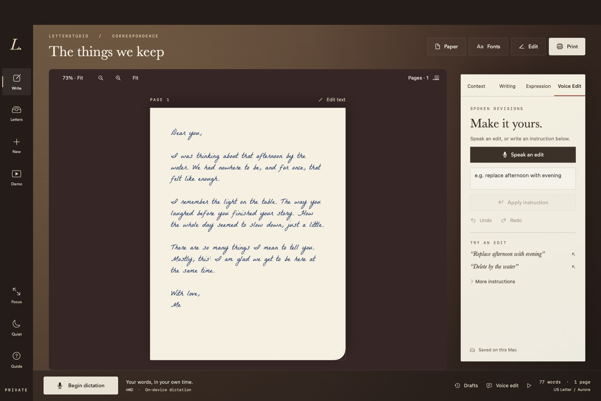
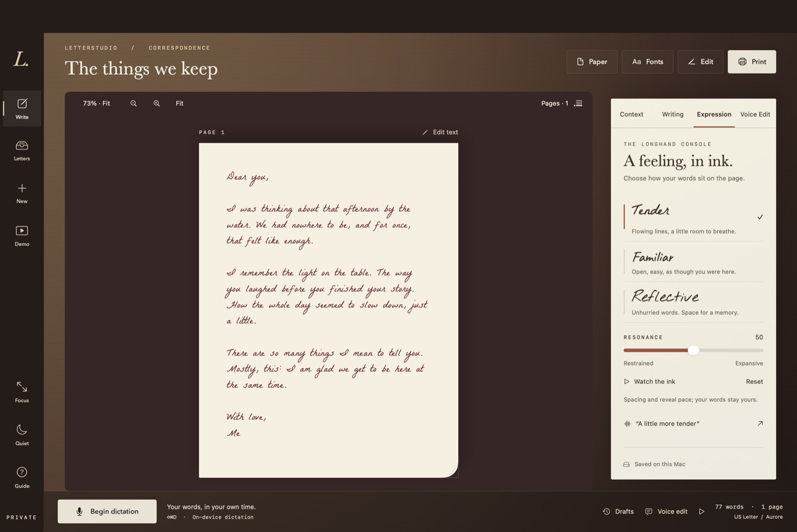
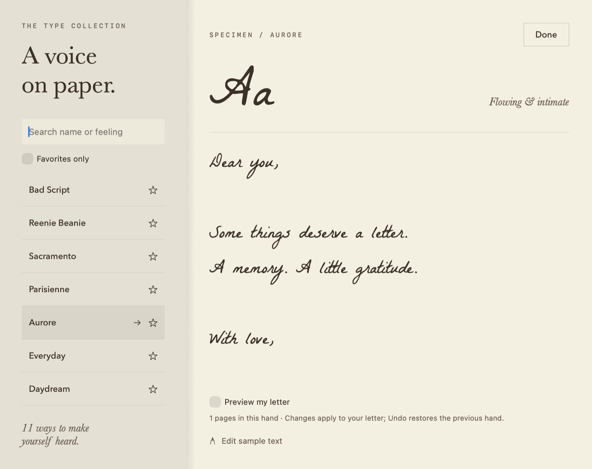
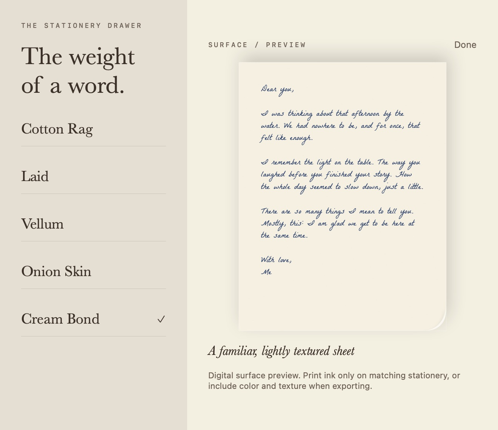
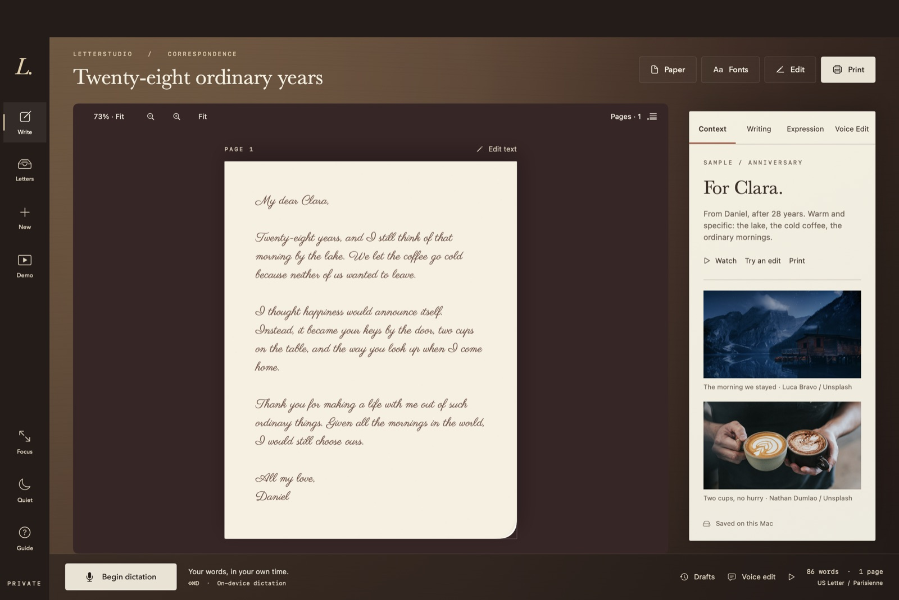
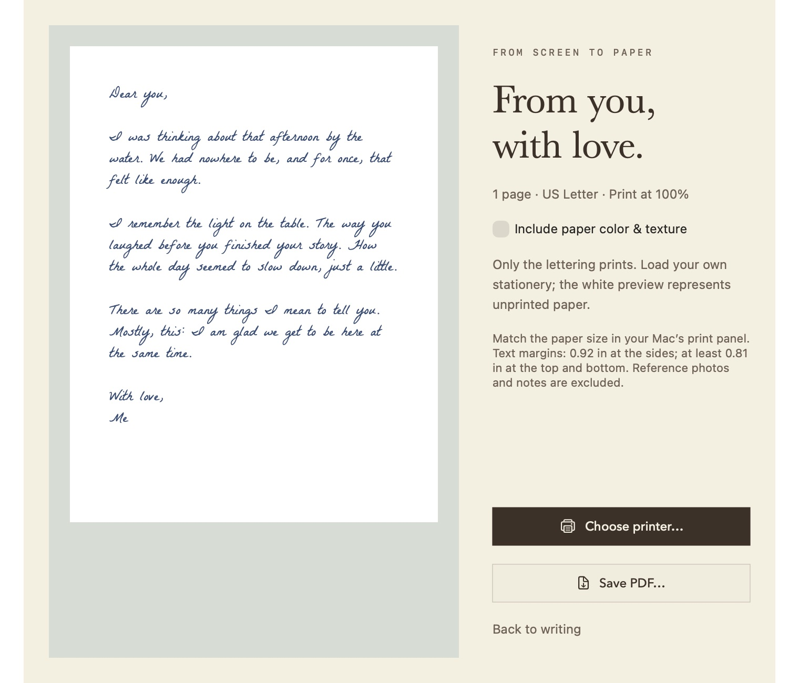
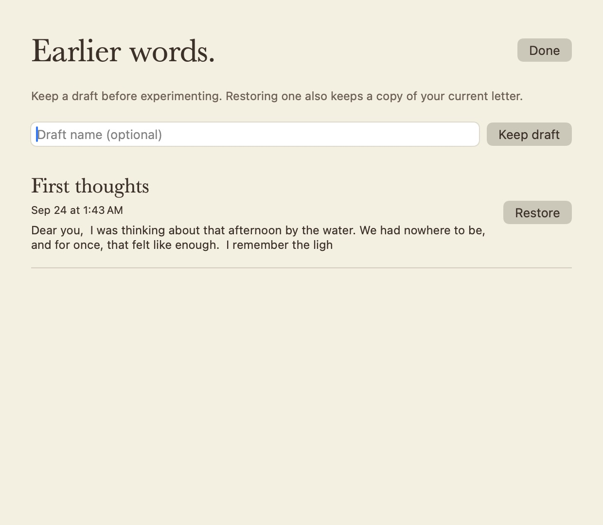
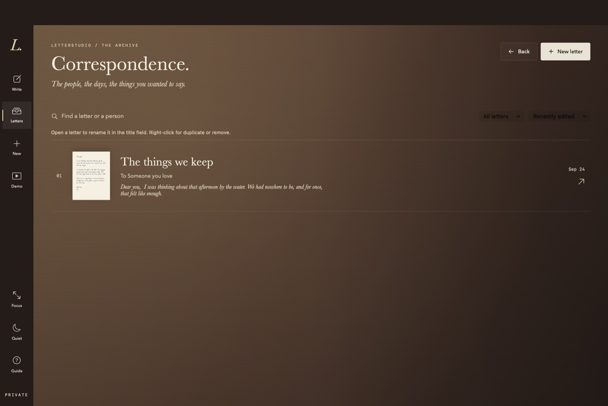

<h1 align="center">LetterStudio</h1>

<p align="center">
  
  
  
  
  
</p>

<p align="center">
  <strong>The letter-writing desk from <em>Her</em>, on your Mac.</strong><br/>
  Speak or type your words and watch them arrive in handwriting — ink, stationery, and all. Then print it, or keep it as a PDF.
</p>

<h3 align="center"><a href="#build"><ins>Build it locally</ins></a></h3>

<p align="center">
  
</p>

## Features

<table>
<tr>
<td width="50%" valign="middle">

### Say It, Then Shape It

Press **Begin dictation** and talk — your words land on the page as you speak. Then fix them hands-free: *"Replace afternoon with evening."* *"Delete the last sentence."* Plain speech is always letter text, never a command.

[Voice edit list →](#voice-edits)

</td>
<td width="50%">
  
</td>
</tr>
<tr>
<td width="50%" valign="middle">

### Give It a Feeling

Choose how your words sit on the page — **Tender**, **Familiar**, or **Reflective** hands, a resonance slider, and five inks from Cedar Blue-Black to Oxblood Sincerity. Presentation changes; your wording never does.

</td>
<td width="50%">
  
</td>
</tr>
<tr>
<td width="50%" valign="middle">

### Eleven Hands

Seven bundled handwriting fonts and four Mac classics. Search by name or mood — try *"romantic"* or *"slanted"* — star your favorites, and preview your own letter in any hand.

</td>
<td width="50%">
  
</td>
</tr>
<tr>
<td width="50%" valign="middle">

### Choose the Paper

Cotton rag, laid, vellum, onion skin, or cream bond, in four stationery colors, on US Letter or A4. Paper texture stays on screen unless you choose to print it.

</td>
<td width="50%">
  
</td>
</tr>
<tr>
<td width="50%" valign="middle">

### A Finished Sample, Built In

Click **Demo** for "Twenty-eight ordinary years" — a complete anniversary letter with a brief, two credited photos, and Parisienne lettering. Replay the ink, try an edit, print it. No microphone needed.

</td>
<td width="50%">
  
</td>
</tr>
<tr>
<td width="50%" valign="middle">

### Print or PDF

Review the exact output before it leaves your Mac. Ink-only by default for real stationery, with paper color on request. Screen and PDF share one Core Text layout, so exported text stays selectable.

</td>
<td width="50%">
  
</td>
</tr>
<tr>
<td width="50%" valign="middle">

### Drafts You Can Return To

Keep named versions before you experiment. Restoring one always saves a safety copy of the current letter first, and drafts survive relaunches.

</td>
<td width="50%">
  
</td>
</tr>
<tr>
<td width="50%" valign="middle">

### An Archive of Correspondence

Every letter is kept, searchable, and sortable. Right-click to duplicate or set one aside — removed letters wait in Recently Removed until you recover them.

</td>
<td width="50%">
  
</td>
</tr>
</table>

**Also in the box:**

- **Reference photos** — keep up to 12 photos and private notes beside a letter. They never print.
- **Watch the ink** — replay the handwriting onto the page, or have the letter read aloud.
- **Focus and Quiet** — hide the panels to just write, or still every animation in one tap.
- **Fifty undo steps** — wording, hand, size, ink, and expression, all reversible.
- **Portable `.letter` files** — export and reopen a letter with its photos and notes.
- **Keyboard first** — ⌘N new, ⌘E edit, ⇧⌘D dictate, ⌘P print, ⌘S save.

---

## Built With

Native frameworks only — no account, no cloud, no paid API.

<p>
  <a href="https://www.swift.org"><kbd> Swift</kbd></a> &nbsp;
  <a href="https://developer.apple.com/xcode/swiftui/"><kbd> SwiftUI</kbd></a> &nbsp;
  <a href="https://developer.apple.com/documentation/appkit"><kbd> AppKit</kbd></a> &nbsp;
  <a href="https://developer.apple.com/documentation/coretext"><kbd> Core Text</kbd></a> &nbsp;
  <a href="https://developer.apple.com/documentation/pdfkit"><kbd> PDFKit</kbd></a> &nbsp;
  <a href="https://developer.apple.com/documentation/speech"><kbd> Speech</kbd></a> &nbsp;
  <a href="https://developer.apple.com/documentation/avfoundation"><kbd> AVFoundation</kbd></a> &nbsp;
  <a href="https://openfontlicense.org"><kbd>✒︎ OFL handwriting fonts</kbd></a>
</p>

---

## Build

**Requires:** macOS 26 and the Swift 6.2 toolchain (Xcode or Command Line Tools).

```sh
bash scripts/test.sh        # core checks: dictation, commands, save/load, PDF pages
bash scripts/build-app.sh   # ad-hoc signed local app (not notarized)
open build/LetterStudio.app
```

Dictation uses Apple's on-device English model; the first use may download it. Letters autosave under `~/Library/Application Support/LetterStudio`.

<details>
<summary><strong>More checks and screenshots</strong></summary>

<br/>

```sh
bash scripts/verify-app.sh                    # app check + a full set of window snapshots in build/
bash scripts/verify-app.sh model              # app check only
bash scripts/verify-app.sh snapshot fonts --fonts   # one snapshot: build/fonts.png
```

Snapshots render in an isolated in-memory window, so they never touch your saved letters or your microphone.

</details>

---

## Voice Edits

Phrase edits need exactly one match. If an instruction is ambiguous, the text stays untouched and the panel says why.

| Say or type | Effect |
|---|---|
| “Replace afternoon with evening” / “Change afternoon to evening” | Replace a phrase |
| “Delete by the water” | Delete a phrase |
| “Insert beautiful before afternoon” / “Insert forever after love” | Insert a word |
| “Delete the last sentence” / “Delete the last paragraph” | Delete a block |
| “New paragraph” | Break the paragraph |
| “Use Baskerville” / “Change font to Daydream” | Change hand |
| “Set font size to 22” / “Make it bigger” / “Make it smaller” | Change size |
| “Undo the last change” / “Redo” | Step through history |
| “Read it back” / “Print preview” | Read aloud / open review |
| “A little more tender”, “more reflective”, “change ink to oxblood sincerity” | Adjust presentation only |
| “Send to the writing desk” | Open print review |

---

## Honest Limits

- The build is ad-hoc signed, not a notarized public release.
- Printing was checked through PDF dimensions and the print preview, not on a physical printer. Your own dictation accuracy is yours to try.
- This is font-based rendering, not a learned copy of your handwriting. It won't synthesize pen strokes.
- Automated checks are a small happy path, not full coverage.

## Credits

Handwriting fonts are bundled under the SIL Open Font License; see [`SOURCES.md`](Sources/LetterCore/Resources/Fonts/SOURCES.md). Sample photographs by Luca Bravo and Nathan Dumlao on Unsplash; see [`CREDITS.md`](Sources/LetterCore/Resources/Walkthrough/CREDITS.md).

## License

No license file yet, so all rights are reserved by default. The bundled fonts keep their own OFL licenses.
